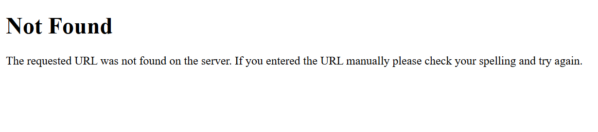

# PE Hackathon 2026 — Reliability Engineering

A production-ready Flask API built for the MLH Production Engineering Hackathon 2026.

## Stack
- **Flask** — Web framework
- **PostgreSQL** — Database
- **Peewee** — ORM (talk to the database using Python)
- **uv** — Package manager
- **pytest** — Testing
- **GitHub Actions** — CI/CD (auto-runs tests on every push)

## Architecture
Request → Flask App → Peewee ORM → PostgreSQL Database → /health check

## Quick Start

### Prerequisites
- Python 3.12+
- PostgreSQL running locally
- uv installed

### Setup
```bash
# 1. Clone the repo
git clone https://github.com/pk504b/PE-Hackathon-Template-2026
cd PE-Hackathon-Template-2026

# 2. Install dependencies
uv sync

# 3. Create database (run in psql)
CREATE DATABASE hackathon_db;

# 4. Configure environment
cp .env.example .env
# Edit .env with your PostgreSQL password

# 5. Run the app
uv run run.py
```

## API Endpoints

| Method | Endpoint | Description | Response |
|--------|----------|-------------|----------|
| GET | `/health` | Service health check | `{"status": "ok", "database": "connected", "uptime_seconds": 189}` |

## Running Tests
```bash
uv run pytest test_health.py -v
```

## Environment Variables
| Variable | Default | Description |
|----------|---------|-------------|
| DATABASE_NAME | hackathon_db | PostgreSQL database name |
| DATABASE_HOST | localhost | Database host |
| DATABASE_PORT | 5432 | Database port |
| DATABASE_USER | postgres | Database user |
| DATABASE_PASSWORD | postgres | Database password |
| FLASK_DEBUG | true | Enable debug mode |

## Reliability Features
- `/health` endpoint with live database connectivity check
- Uptime tracking from service start
- Graceful error handling — returns clean JSON on failure
- Automated test suite with pytest
- CI/CD via GitHub Actions — tests run on every push  

## Failure Modes

### Database Goes Down
**What happens:** The /health endpoint catches the connection error 
and returns:
```json
{
  "status": "error", 
  "database": "unreachable",
  "reason": "connection refused"
}
```
**How we detect it:** Every request to /health pings the database 
with SELECT 1. If it fails, we know immediately.

**How to fix it:** Restart PostgreSQL service. App recovers 
automatically on next request there would be no restart required 

### App Gets a Bad Route
**What happens:** Returns clean JSON instead of an ugly HTML error page:
```json
{"error": "Resource not found", "status": 404}


```
**How we detect it:** 404 error handler catches all unknown routes.

### App Crashes Completely
**What happens:** Docker restart policy brings it back up automatically 
(see Chaos Mode section).
**How we detect it:** Uptime counter resets to 0 on /health endpoint.
